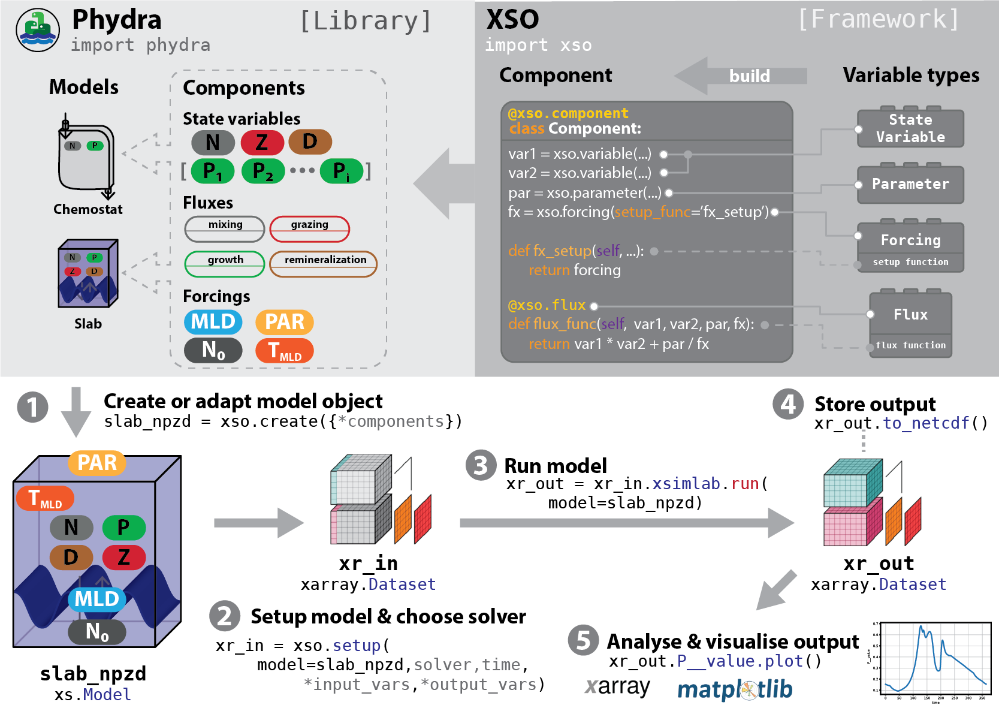

# phydra

A library of plankton community models utilizing the XSO framework 
([Xarray-simlab-ODE](https://github.com/ben1post/xarray-simlab-ode)). 

> Disclaimer: The library and framework are in the early stages of development. 
> Feedback, testing, and contributions are very welcome.

## What is phydra?
Phydra is a Python package that provides a library of modular plankton community 
models built using the XSO framework. XSO provides a streamlined, interactive and 
reproducible workflow for building and running models. The model input and output 
data is an Xarray-Dataset directly compatible with a wealth of tools of the Python scientific ecosystem.



## Usage & Installation

Assuming that you have `git` and [conda](https://conda.io/docs/index.html)
installed, you can install all the files and dependencies required to run the 
notebooks in a new conda environment using the following commands:

```bash
$ git clone https://github.com/ben1post/phydra
$ cd phydra
$ conda env create -n phydra_env -f environment.yml
$ conda activate phydra_env
```

Then run the command below to start the Jupyterlab application:

```bash
$ jupyter lab
```

This should open an interactive session in your browser. Navigate to the
[notebooks](https://github.com/ben1post/phydra/tree/master/notebooks) directory
and open the included notebooks for an interactive presentation of included 
plankton community models.

## Package structure
The plankton community models included in the Phydra package are available to the 
user at multiple hierarchical levels: as a library of pre-built XSO model _components_, 
as pre-assembled _model objects_, and as exemplary model simulations in interactive 
Jupyter notebooks. These levels are described below.


- _**Components**_: The first version of the library will contain all 
  _components_ used to create the three model applications presented in the notebooks.
    
- _**Model objects**_: The first release of Phydra contains the _model 
  objects_ defined in the three model applications presented in section _UseCases_. 
  The _model objects_ can be imported from the library and can be readily 
  setup, modified, and run by a user.
    
- _**Example notebooks**_: _Model objects_ only define the collection of 
  _components_. To run a model, the input parameters still need to be 
  defined and supplied at runtime. The Phydra library comes with three fully 
  documented model applications that are presented in interactive Jupyter 
   notebooks. These notebooks show all steps from creating the _model setup_ 
  object to analyzing model output and provide a template for further 
  exploration  and experimentation with the provided plankton community models.
    

# Motivation

The open-source and extensible nature of Phydra and XSO enables users to 
customize and develop processes that accurately describe a particular
ecosystem.  In a collaborative effort to promote efficient, transparent, 
and reproducible marine ecosystem modeling, Phydra encourages users to 
contribute their own _components_ and _models_ to the core library. The 
Phydra library could potentially offer a comprehensive, well-documented, 
and peer-reviewed codebase for the scientific exploration of marine 
ecosystem models.


## Contributing

The library is in the early stages of development. Feedback from testing and contributions are very welcome. 
See [GitHub Issues](https://github.com/ben1post/phydra/issues) for existing issues, or raise your own.
Code contributions can be made via Pull Requests on [GitHub](https://github.com/ben1post/phydra).

## License

`phydra` was created by Benjamin Post. It is licensed open source under the terms of 
the BSD 3-Clause license.
